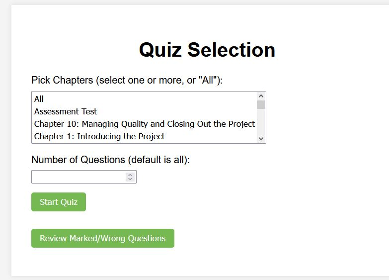
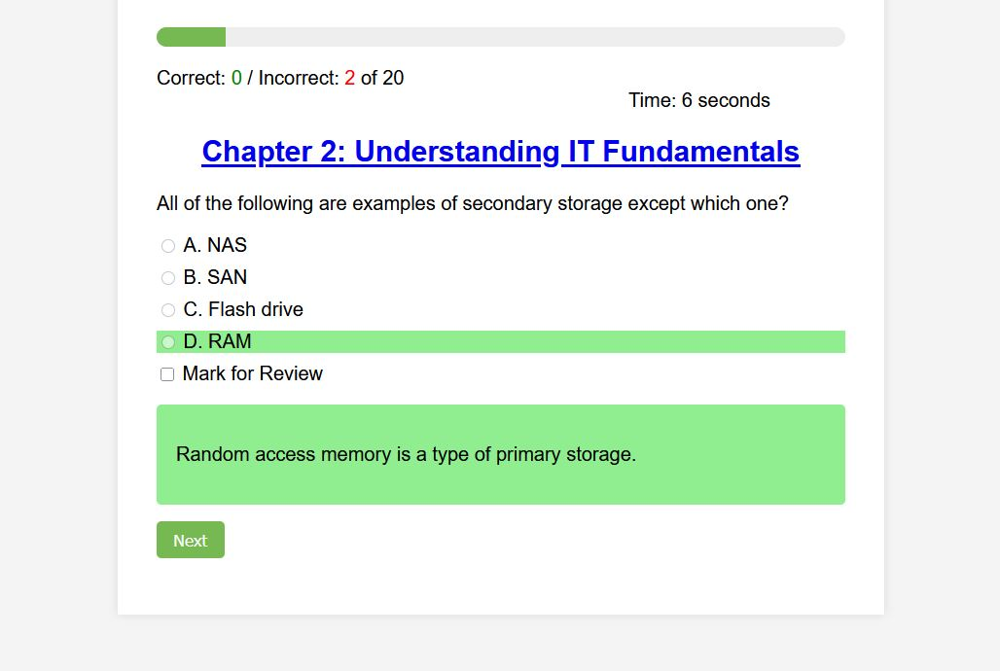
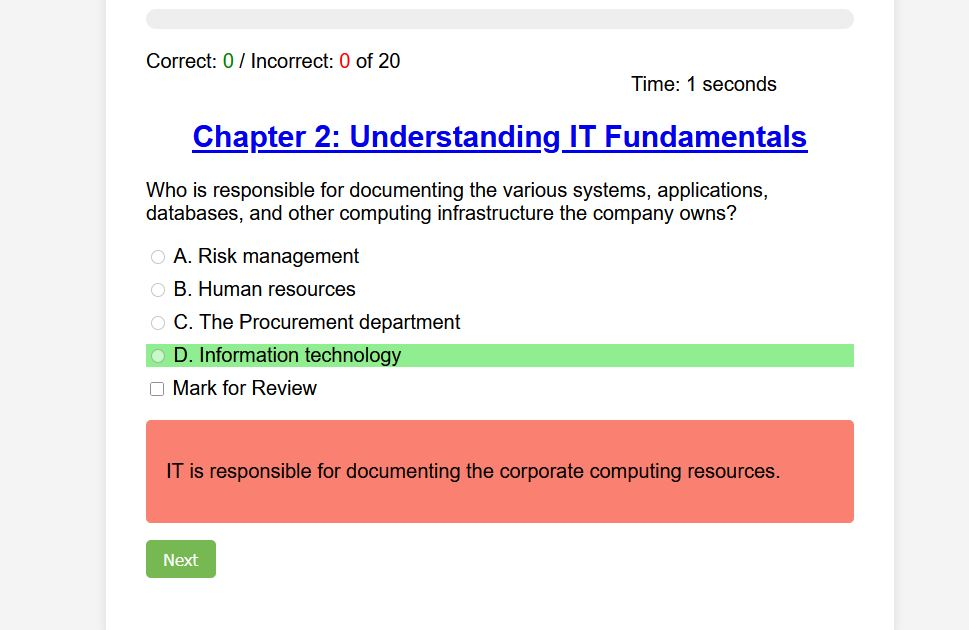
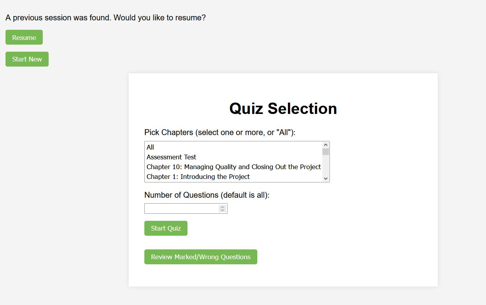

# project-plus
project +  testing and help to pass the COMPTIA poject plus  (2025) edition

## What it looks like:
Main menu

If it is correct:

If you get it wrong:

Tracks both correct and non-correct answers.
Has the abilty to mark for later study will make the question pop up "more"

Has the ability to pick up where it left off if you wish :

## Note: this is ment to be run offline:

While this can be put online, it’s just standard HTML and some JavaScript. It’s meant to be run offline — it can be hosted locally or simply opened by double-clicking and running it in a browser. This is the project, along with the CompTIA 005 test, answers, and the study guide I used.